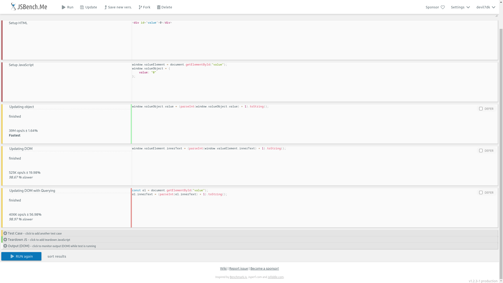

# Setup

1. Install [NodeJS](https://nodejs.org/en/download)
2. Install [VSCode](https://code.visualstudio.com/download)
3. Clone the repository
   ```sh
   git clone https://github.com/Devil7DK/react-samples-2024.git
   ```
4. Open cloned folder in VSCode
5. Install recommended extensions from sidebar
6. Right click any HTML file and click on "Open with Live Server"

# Topics

1. What and Why React. Read more [here](https://legacy.reactjs.org/tutorial/tutorial.html#what-is-react)
2. JSX and its advantages. Read more [here](https://legacy.reactjs.org/docs/introducing-jsx.html)
3. Virtual DOM and its advantages. Read more [here](https://reactjs.org/docs/faq-internals.html) and [here](https://medium.com/devinder/react-virtual-dom-vs-real-dom-23749ff7adc9)
4. Bootstraping React project
5. React Components and Lifecycle.
   1. Class Components
   2. Functional Components
6. React Hooks
7. Routing in React
8. State Management in React - Context API, Redux and MobX
9. API Calls in React
10. Deploying React App

# Images/Ilustrations

## Object vs DOM - Update Speed

<a href="https://jsbench.me/3wlr6n1nrf/1">
  
</a>

## React Component Lifecycle

### Lifecycle Methods (Class Component)

<a href="https://programmingwithmosh.com/javascript/react-lifecycle-methods/">
  
</a>

### Functional Component Lifecycle

<a href="https://medium.com/@galmargalit/react-function-components-hooks-lifecycle-diagram-14f76e0a5988">
  
</a>

## React Architecture Examples

<a href="https://medium.com/geekculture/react-js-architecture-features-folder-structure-design-pattern-70b7b9103f22">
  
</a>

<a href="https://handsonreact.com/docs/architecture">
  
</a>

<a href="https://www.knowledgehut.com/blog/web-development/react-js-architecture">
  
</a>

# Courses

- [Recommended Courses](https://legacy.reactjs.org/community/courses.html) - Both free and paid options recommended by react community
- [Official Certification from Facebook](https://www.facebook.com/business/learn/front-end-back-end-developer-certificate-coursera) - Not really recommended for beginners

# Must Read Articles

- [Fundamentals of functional programming in React](https://blog.logrocket.com/fundamentals-functional-programming-react/)
- [Index as a Key is an Anti-Pattern](https://robinpokorny.com/blog/index-as-a-key-is-an-anti-pattern/)
- [This is why we need to bind event handlers in class components](https://www.freecodecamp.org/news/this-is-why-we-need-to-bind-event-handlers-in-class-components-in-react-f7ea1a6f93eb/)
- [Setting State On An Unmounted Component](https://reacttraining.com/blog/setting-state-on-unmounted-component)

# References

- [React Documentation](https://react.dev/learn)
- [W3Schools React Tutorial](https://www.w3schools.com/REACT/default.asp)
- [React without JSX](https://www.xenonstack.com/blog/react-without-jsx)
- [Babel Standalone Documentation](https://babeljs.io/docs/babel-standalone)
